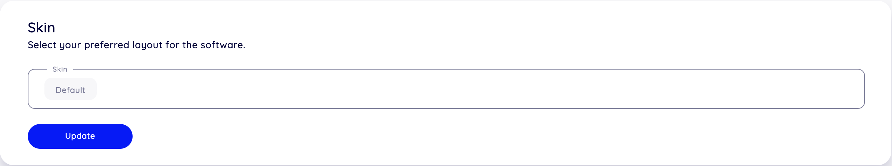
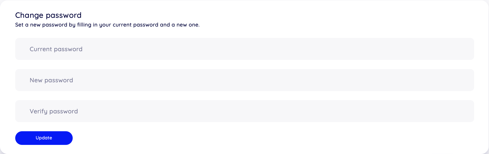
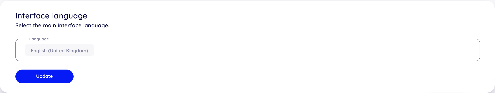
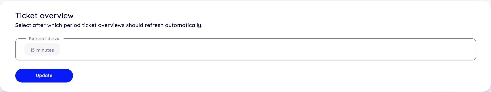
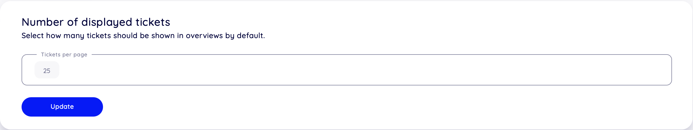

Personal Preferences
====================

Use this screen to set personal preferences in OTOBO. All settings changed on this site affect only your profile, and does not affect the behavior of OTOBO for other users.

Skin
----

Here you can change the skin of your OTOBO interface.

   Skin selection

Select a skin from the drop-down list.

Change password
---------------

Here you can change your current password. To change the password, all fields must be filled.

   Change Password

Current password
   Type your current password for security reasons, if you want to change it.

New password
   Type your new password here.

Verify password
   Type your new password again to avoid misspelling the new password.

Interface language
------------------

Here you can change the language of your OTOBO interface.

   Language selection

Only those languages are listed by default, in which OTOBO is translated more than 95%.

Time Zone
---------

Here you can change the timezone to match your current location to get proper date and time calculation in OTOBO.

   Time Zone selection

Select the location where you are currently in.

Ticket overview
---------------

It is possible to make overview screens automatically refreshed after a period of time.

   Overview Refresh Time

Select a refresh interval from the drop-down list.

.. warning::

   Refreshing the overview screens too often can cause performance issues on large systems with many users.

Number of displayed tickets
---------------------------

Here you can select how many tickets should be shown by default.

   Number of displayed tickets

Select a refresh interval from the drop-down list.