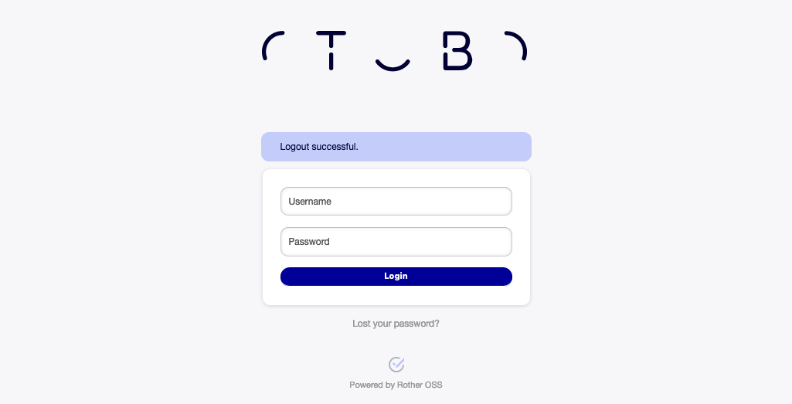
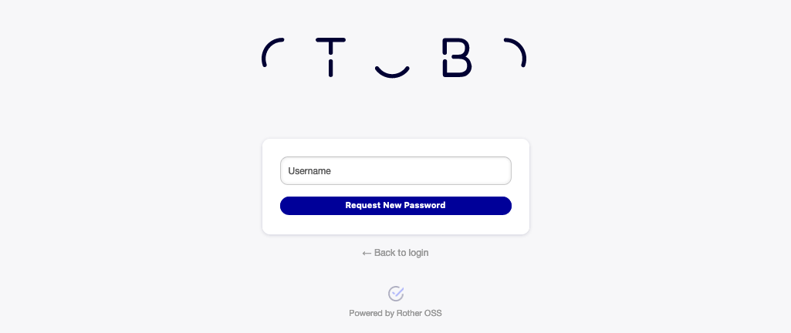
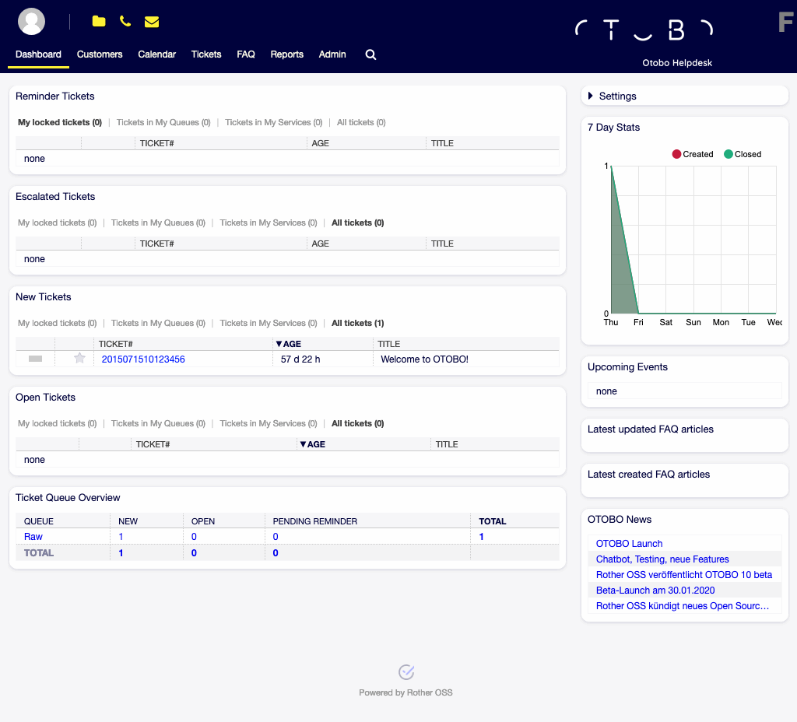
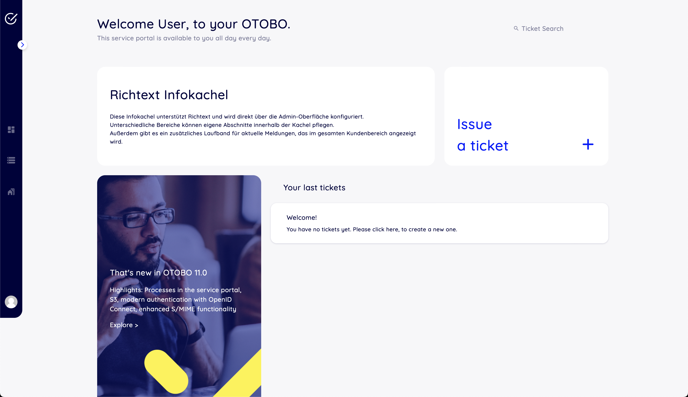

Introduction
============

This manual is intended for use by OTOBO agents. The chapters describe the usage of the OTOBO software as an agent user.

Login to Agent Interface
------------------------

The agent interface is available at the following location.

.. note::

   You have to replace ``<OTOBO_HOST>`` with your domain.

.. code-block:: none

   https://<OTOBO_HOST>/otobo/index.pl

You need an agent account to be able to use OTOBO. If you have no account yet, please contact your administrator.

   Agent Login Screen

If you forget your password, click on the *Lost your password?* link, and follow the instructions there.

   Request New Password Screen

After a successful login, the agent dashboard will be displayed.

   Agent Interface

Login to Customer Interface
------------------------

The customer interface is available at the following location.

.. note::

   You have to replace ``<OTOBO_HOST>`` with your domain.

.. code-block:: none

   https://<OTOBO_HOST>/otobo/customer.pl

You need a customer account to be able to use OTOBO. If you have no account yet, please contact your administrator or signup (if enabled by the administrator).

.. figure:: customer/dashboard/images/login.png
   :alt: Customer Login Screen

   Customer Login Screen

If you forget your password, click on the *Lost your password?* link, and follow the instructions there.

.. figure:: customer/dashboard/images/lost-password.png
   :alt: Request New Password Screen

   Request New Password Screen

After a successful login, the customer dashboard will be displayed.

   Customer Interface
